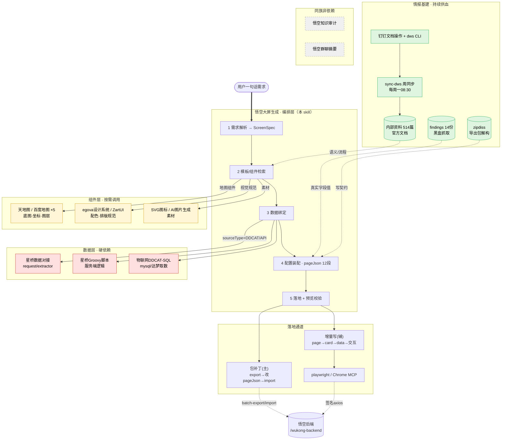

# 悟空大屏生成 · 架构依赖结构图

> 说明本 skill（编排层）与其它 skill / 基建 / 悟空后端的依赖关系。
> 依赖目前多为"架构配套"（执行时按需调用对应 skill），尚未固化为代码级调用。

## 分层依赖图

## 依赖清单

| 层级 | 依赖项 | 类型 | 挂接点 |
|------|--------|------|--------|
| 数据层 | 星桥数据对接 / 星桥Groovy脚本 / 物联网DDCAT-SQL | 🔴 硬依赖 | 第3层 数据绑定 |
| 组件层 | 天地图WebAPI / 百度地图(WebAPI·JSAPI-WebGL·3D-MapVThree·UI组件库) | 🟡 按需 | 第2层 地图组件 |
| 组件层 | egova设计系统 / ZartUI(组件规范·界面生成) | 🟡 按需 | 第2层 视觉规范 |
| 组件层 | SVG图标生成器 / 定制图标生成器 / AI图片生成 | 🟡 按需 | 第2层 素材 |
| 情报基建 | 钉钉文档操作 + dws CLI | 🟢 基建 | sync-dws 周同步 |
| 情报基建 | 钉钉知识图谱 / 知识图谱（可选） | 🟢 基建 | 文档检索增强 |
| 落地通道 | playwright / Claude in Chrome MCP | ⚙️ MCP | 第5层 增量写+预览 |
| 同族 | 悟空知识审计 / 悟空群聊摘要 | ⚪ 非依赖 | 平级独立工具 |

## 数据流向（虚线 = 喂数据，不是调用）
- 官方文档（内部资料 514 篇）→ 给"模板/组件检索"提供语义与配置流程
- 黑盒抓取（findings 14 份）→ 给"配置装配"提供真实字段值
- 导出包解构（zipdiss）→ 给"配置装配"提供 pageJson 写契约
- sync-dws 每周回灌新文档，保持情报新鲜
