# **麒舰案件对接前期准备与常见问题说明**

# **前期准备工作**

现场工程人员应确保以下工作已经完成，再创建支持案件。

## **1.1 确保网络双向畅通**

第三方-->我方：第三方需要调用我方麒舰第三方上报接口。

我方-->第三方：第三方上报的案件信息通常有图片等附件，我方需访问第三方附件地址获取相关附件。

## **1.2 配置相关授权信息，提前同步给第三方**

详见文档**1.1-1.3章节**。

1. 创建应用后，将clientId、clientSecret信息同步给第三方。
2. 对接系统表配置之后的刷新可以使用灵珑的api管理，调用/unity/openapi/config/clear-sys-config接口，相关认证可以参考已有的麒舰接口。
3. 对应的对接代理人需要新建一个部门、一个人员来专门处理对应的第三方对接案件。

[请至钉钉文档查看附件《V22市区对接配置文档V1.4.docx》](https://alidocs.dingtalk.com/i/nodes/G1DKw2zgV2RXpGMNTDvyLynMVB5r9YAn?iframeQuery=anchorId%3DX02mklyum1kz7f6dj2bcj)

## **1.3 配置相关采集相关信息，提前完成现场自测**

详见文档**2.1-2.4章节**。

采集配置的大体逻辑：首先，在相关的工作流节点中，将对接代理人设置为参与者。然后在相关表中完成节点信息、案件来源、参与者等采集配置。当案件在工作流中流转到已配置的节点，并且该案件的参与者和案件来源信息均符合前述配置要求时，系统会在 API_MESSAGE_SEND 或 API_MESSAGE_SEND_HIS 表中生成一条采集记录。

配置完成后，工程人员可自行上报一条测试案件，当案件批转到配置的节点时，查看相关表是否有对应记录生成,检查sql如下：

select \* from api_message_send where receiver_code =:receiver_code and action=:action and relation_id=:relation_id

select \* from api_message_send_his where receiver_code =:receiver_code and action=:action and relation_id=:relation_id

其中：:receiver_code-之前配置的应用编码，:action-采集信息类中的操作名，:relation_id-案件的rec_Id.

[请至钉钉文档查看附件《V22市区对接配置文档V1.4.docx》](https://alidocs.dingtalk.com/i/nodes/G1DKw2zgV2RXpGMNTDvyLynMVB5r9YAn?iframeQuery=anchorId%3DX02mklzpq6f0tf47q6fb4r)

**备注**：可以先创建一条测试案件，将案件操作到相关阶段，然后查看wf_act_inst表数据，进行配置。

比如配置受理员不受理的采集信息，可以直接创建一条测试案件，走到受理员，受理员进行不受理之后，查看wf_act_inst相关表数据。

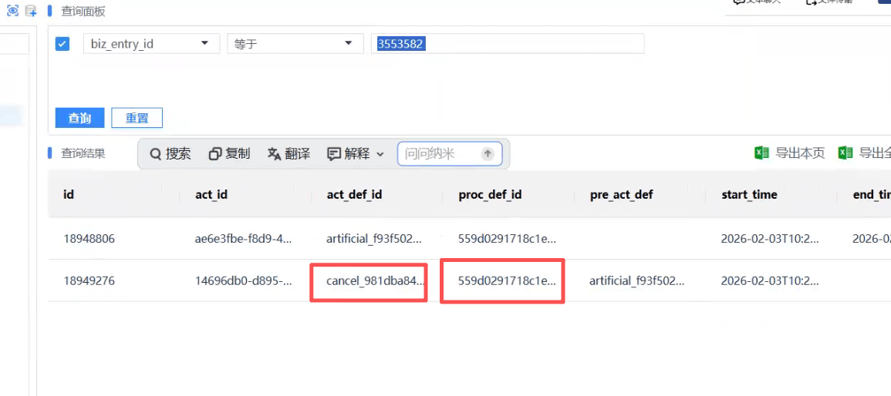

> 图示说明：可先按 biz_entry_id 查询 wf_act_inst 记录，重点查看 act_def_id、proc_def_id 等节点定义信息。

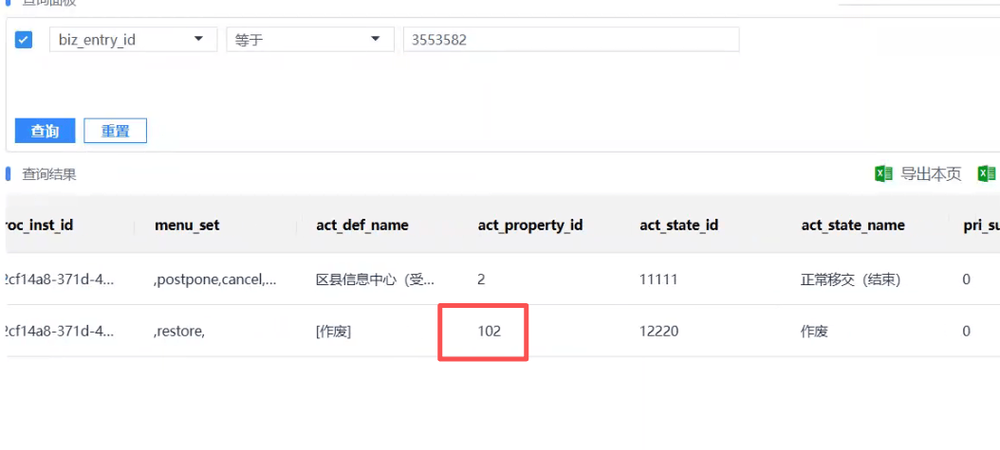

> 图示说明：查询结果里可进一步确认节点属性值，例如作废节点对应的 act_property_id 为 102。

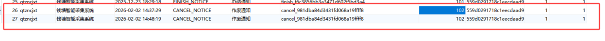

> 图示说明：在采集记录表中可看到作废通知相关记录，作废场景对应 CANCEL_NOTICE，节点属性值为 102。

## **1.4 向第三方发送相关接口说明文档**

[请至钉钉文档查看附件《V22市区对接标准文档V1.4.docx》](https://alidocs.dingtalk.com/i/nodes/G1DKw2zgV2RXpGMNTDvyLynMVB5r9YAn?iframeQuery=anchorId%3DX02mklzsgt2uui8lt77rp)

1. 告知第三方现场的真实麒舰接口地址，防止第三方调用文档中带有v22-api/的路径地址，出现相关问题。
2. 向第三方强调接口认证信息在第五节，确保第三方有提前了解接口的认证方式。

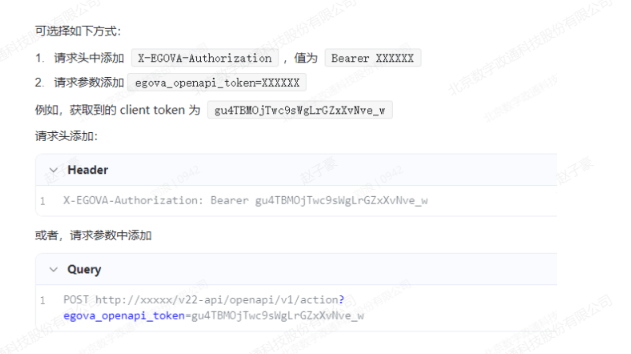

> 图示操作：接口认证可二选一，既可以在请求头传 X-EGOVA-Authorization: Bearer token，也可以在请求参数中传 egova_openapi_token。

## **1.5 确定案件上报相关字段**

* 1. 普通字段：需要事先与第三方确认好案件来源（event_src_id/name）、案件类型（rec_type_id/name）、大小类（event_type_id/name、main_type_id/name、sub_type_id/name）等相关字段取值。
  2. 特殊字段：部分现场工作流配置中对于案件的部分字段有要求，比如杭州现场目前工作流中案件的流转需要有区划信息（district_id/name），否则案件无法正常在工作流中流转，如果目前现场有相关情况，对应特殊字段也要事前与第三方确认。

相关问题示例：

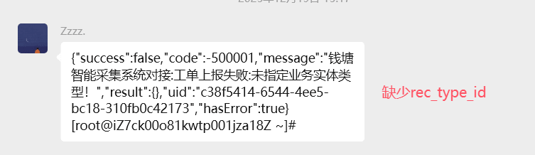

> 图示说明：工单上报失败提示“未指定业务实体类型”，对应缺少 rec_type_id 字段。

> 图示说明：杭州现场这类流程如果缺少 district_id，会提示“未找到合适处理人，请检查流程配置”。

# **常见问题说明**

目前暂时未遇到500报错，确保前期准备工作有落实到位，大多数常见问题都可以避免。

## **接口404**

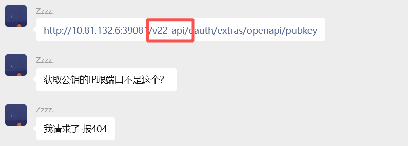

> 图示说明：第三方把 /v22-api/ 拼进了获取公钥接口地址，导致请求 /oauth/extras/openapi/pubkey 时返回 404。

告知第三方现场麒舰地址，确定第三方调用的是正确地址。

## **认证错误**

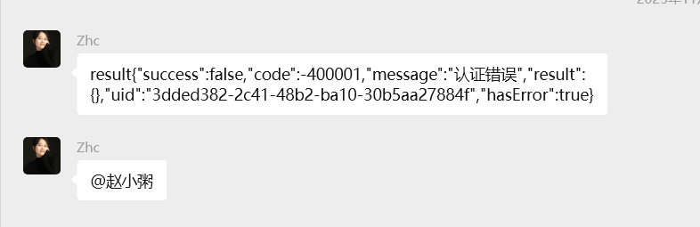

> 图示说明：返回“认证错误”时，通常表示第三方认证方式或 token 使用方式不正确。

第三方接口认证方式有问题。

认证方式见**第五节、第七节**

[请至钉钉文档查看附件《V22市区对接标准文档V1.4.docx》](https://alidocs.dingtalk.com/i/nodes/G1DKw2zgV2RXpGMNTDvyLynMVB5r9YAn?iframeQuery=anchorId%3DX02mkqi4o0ort48npbwmi)

大体逻辑如下：

* 1. **调用公钥接口**（**5.1小节**）：/oauth/extras/openapi/pubkey, 从返回message中取出公钥
  2. **私钥加密**：加密demo见 **7.1小节**

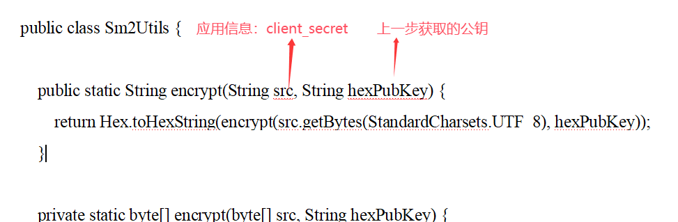

> 图示说明：client_secret 需要结合上一步获取到的公钥，按示例代码进行 SM2 加密。

* 1. **调用token接口**（**5.2小节**）：/oauth/extras/openapi/client ，入参：

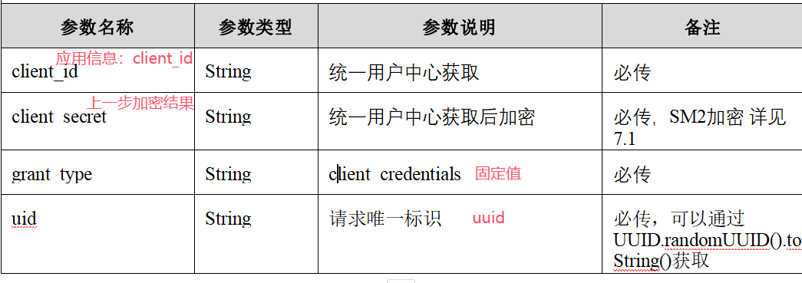

> 图示说明：获取 token 时需传 client_id、加密后的 client_secret、固定值 client_credentials，以及 uuid。

* 1. **认证：**

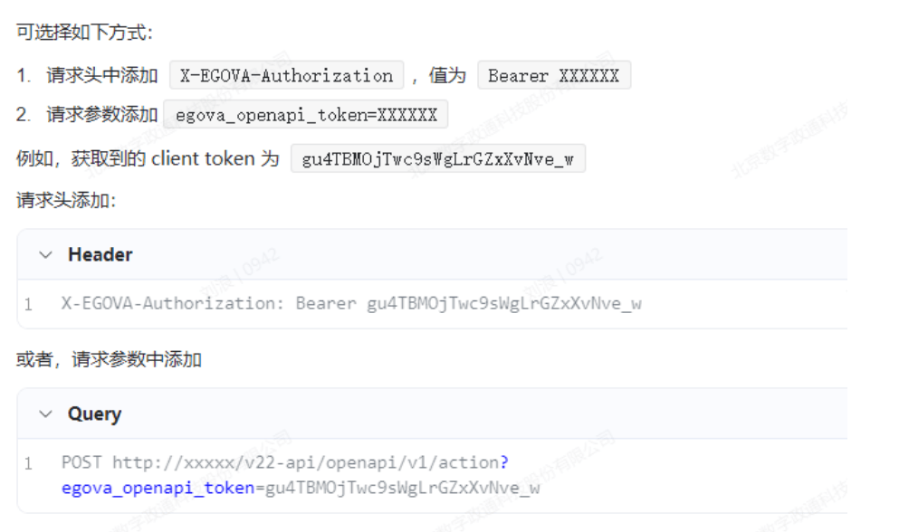

> 图示操作：拿到 client token 后，可放在请求头 Bearer 中，也可放在 egova_openapi_token 参数中传递。

## **参数错误**

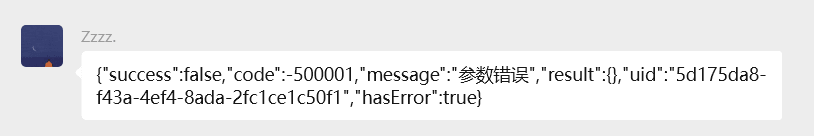

> 图示说明：接口返回“参数错误”时，需要优先检查第三方入参是否遗漏或字段名是否填写错误。

第三方没有按照接口文档严格入参，让第三方检查必传字段是否都有、字段名称、字段类型是否有误。

示例：第三方笔误，大写I写成小写l。

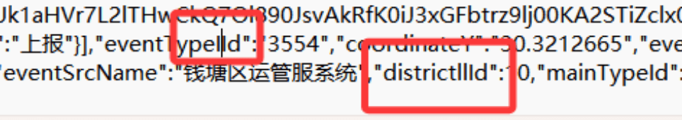

> 图示说明：示例里字段名存在拼写问题，像 typeId、districtId 这类字段容易把大写 I 与小写 l 混写。

## **多媒体下载失败**

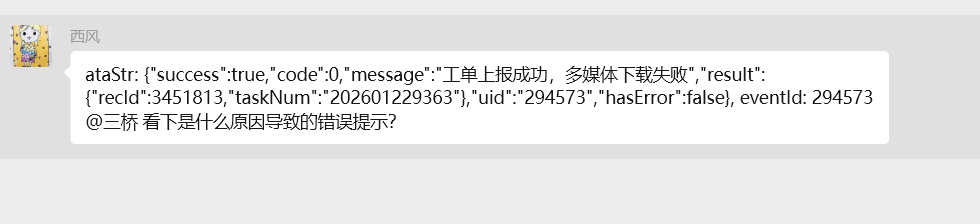

> 图示说明：工单虽上报成功，但返回“多媒体下载失败”，通常说明系统无法访问第三方附件地址。

在服务器使用curl命令访问第三方附件地址，可能网络不通

curl -I 多媒体路径

curl -I <https://example.com/path/to/image.jpg>

确定网络不通之后，可以开通网络策略或者告知第三方使用base64方式

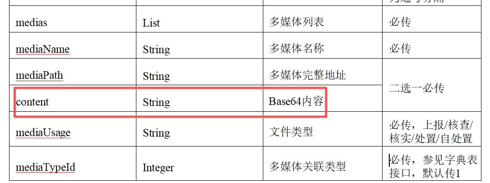

> 图示说明：文档里的 medias.content 字段支持传 Base64 内容，网络不通时可改用这种方式上传附件。

## **工作流相关提示**

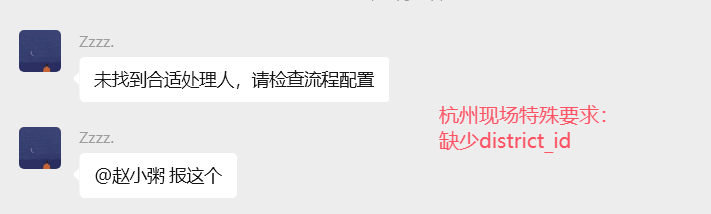

> 图示说明：若提示“未找到合适处理人”，要结合现场流程要求检查是否缺少 district_id 等关键流转字段。

检查工作流正常流转所需字段，第三方入参是否全部包含。

## **使用base64格式上传文件后，文件不显示**

检查第三方入参字段是否含有中文。

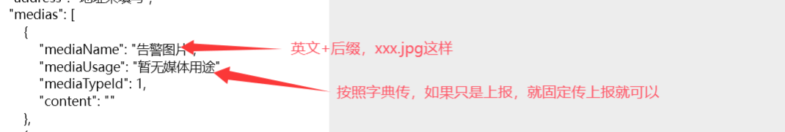

> 图示说明：使用 Base64 上传时，mediaName 应使用英文文件名加后缀，mediaUsage 按字典值传，如上报可固定传“上报”。

**2.7 获取token接口报错**

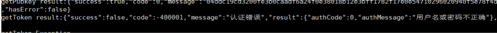

> 图示说明：获取 token 返回“用户名或密码不正确”时，需要重点检查对接代理人的账号配置。

检查API_SYS_INFO相关记录的代理人字段的字段值

**场景1**：现场手动输入导致有不相干字符

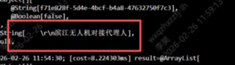

> 图示说明：代理人字段如果被手动录入了异常字符或错误值，也会导致 token 接口认证失败。

**场景2**：对接代理人应该配置登录账号字段，现场配置的是人员名称

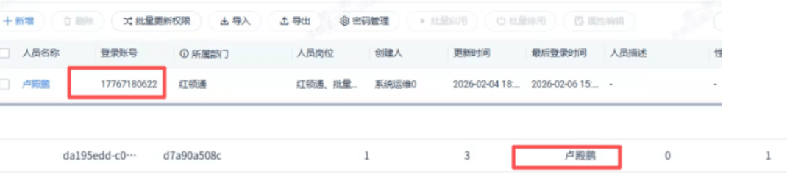

> 图示说明：对接代理人应填写登录账号，如图中的数字账号，而不是填写人员名称。

**解决办法：**

可以直接尝试删除对接人账号，然后重新建一个同名对接人

**2.8 多媒体地址过长**

> 图示说明：返回“多媒体地址过长”时，通常是 mediaPath 被错误塞入了超长内容。

第三方入参错误，把图片的base64的值放到了mediaPath

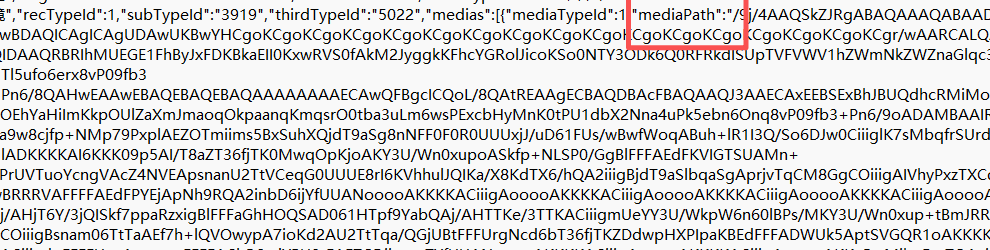

> 图示说明：该示例中 mediaPath 实际上传的是 Base64 值，正确做法是把 Base64 放到 medias.content 字段。

**2.9 未找到合适处理人，请检查流程配置**

第三方入参缺少districtId字段，而现场的工作流需要这些字段

**2.10 登记栏受理员看不到第三方对接的案件**

登记栏视图逻辑必须是自己的岗位，然后

[请至钉钉文档上传「图片」](https://alidocs.dingtalk.com/i/nodes/G1DKw2zgV2RXpGMNTDvyLynMVB5r9YAn?iframeQuery=anchorId%3DX02aztsgw)
