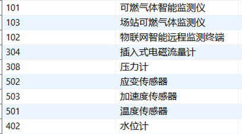

## 需求

物联网 1.0 对接仙桃城市生命线设备基础数据和实时数据。

- 星桥接口：使用空接口 `dex-api/free/req-resp` 触发前置脚本和后置脚本。
- 源端接口：`http://59.208.239.152:38847/gsc-ishare/v2/bztp/get`。
- 源端 token 接口：`http://59.208.239.152:38847/gsc-ishare/v2/itopdm/upms/oauth/token`。
- 物联网 1.0 基础数据免密接口：`/free/admin/import`。
- 物联网 1.0 实时数据免密接口：`/free/exchange/equip/list`。
- 基础数据单独配置一个 API 脚本。
- 实时数据配置一个 API 脚本，循环拉取本次对接范围内的 9 类实时业务数据。

脚本中涉及的 IP、端口、`client_id`、`client_secret` 需要部署时按现场环境替换。

## 设备类型范围

本次只处理以下设备类型：



| 设备类型 ID | 设备类型名称 |
| --- | --- |
| 101 | 可燃气体智能监测仪 |
| 102 | 物联网智能远程监测终端 |
| 103 | 场站可燃气体监测 |
| 304 | 插入式电磁流量计 |
| 308 | 压力计 |
| 402 | 水位计 |
| 501 | 温度传感器 |
| 502 | 应变传感器 |
| 503 | 加速度传感器 |

## 监测项编码

PDF 中实时表字段对应的物联网监测项编码如下：

| 源端字段 | 监测项名称 | 说明 |
| --- | --- | --- |
| `ch4_value` | 甲烷浓度 | GasMonitor |
| `ch4_state` | 甲烷状态 | GasMonitor，值为 `1` 时按报警处理 |
| `instant` | 瞬时流量 | WaterPipeFlowmeterMonitor |
| `press` | 压力 | WaterPipePressureMonitor |
| `water_level` | 水位 | DrainPipeLevelMonitor、DrainPipeLevelSample5M |
| `acceleration` | 加速度 | BridgeAcceSensorMonitor |
| `humidity` | 湿度 | BridgeHygrometerMonitor |
| `temperature` | 温度 | BridgeTemperSensorMonitor |
| `strain` | 微应变 | BridgeStrainSensorMonitor |

## 基础数据 API 脚本

### 配置说明

- 将下面的前置脚本和后置脚本配置到同一个空接口 `dex-api/free/req-resp`。
- 调用空接口时，body 可以为空；也可以传 `page`、`count` 控制源端分页。
- 基础数据脚本查询源端 `GspspEquipInfoView`，转换后推送到物联网 1.0 `/free/admin/import`。
- 设备类型取源端 `sblx` 后三位，例如 `jcsblx0304` 转为 `304`。
- 监测项优先根据源端 `jczb`、`jczbmc` 生成；源端未返回监测项时，对明确设备类型做兜底补充。

### 前置脚本

```groovy
import org.springframework.http.HttpHeaders
import com.egova.api.util.http.HttpUtils
import com.egova.json.utils.JsonUtils
import java.text.SimpleDateFormat

// ========== 现场配置：部署时需要替换地址、端口和认证参数 ==========
var sourceBaseUrl = 'http://59.208.239.152:38847'
var iotBaseUrl = 'http://173.16.0.17:8084/iot-api'
var clientId = 'xxx'
var clientSecret = 'xxx'

var tokenUrl = sourceBaseUrl + '/gsc-ishare/v2/itopdm/upms/oauth/token'
var sourceGetUrl = sourceBaseUrl + '/gsc-ishare/v2/bztp/get'
var iotImportUrl = iotBaseUrl + '/free/admin/import'
var equipInfoBiSigns = 'bztp-ubop-munf-GspspEquipInfoView'
var equipInfoName = 'GspspEquipInfoView'

// 本次允许同步的设备类型
var allowedEquipTypeIds = [101, 102, 103, 304, 308, 402, 501, 502, 503]

// 监测项编码字典
var fieldCatalog = [
    'ch4_value'   : ['fieldCode': 'ch4_value', 'fieldName': '甲烷浓度', 'fieldUnit': '', 'dataType': 0, 'genAlarmFlag': 1, 'displayOrder': 1],
    'ch4_state'   : ['fieldCode': 'ch4_state', 'fieldName': '甲烷状态', 'fieldUnit': '', 'dataType': 0, 'genAlarmFlag': 1, 'displayOrder': 2],
    'instant'     : ['fieldCode': 'instant', 'fieldName': '瞬时流量', 'fieldUnit': '', 'dataType': 0, 'genAlarmFlag': 1, 'displayOrder': 3],
    'press'       : ['fieldCode': 'press', 'fieldName': '压力', 'fieldUnit': '', 'dataType': 0, 'genAlarmFlag': 1, 'displayOrder': 4],
    'water_level' : ['fieldCode': 'water_level', 'fieldName': '水位', 'fieldUnit': '', 'dataType': 0, 'genAlarmFlag': 1, 'displayOrder': 5],
    'acceleration': ['fieldCode': 'acceleration', 'fieldName': '加速度', 'fieldUnit': '', 'dataType': 0, 'genAlarmFlag': 1, 'displayOrder': 6],
    'humidity'    : ['fieldCode': 'humidity', 'fieldName': '湿度', 'fieldUnit': '', 'dataType': 0, 'genAlarmFlag': 1, 'displayOrder': 7],
    'temperature' : ['fieldCode': 'temperature', 'fieldName': '温度', 'fieldUnit': '', 'dataType': 0, 'genAlarmFlag': 1, 'displayOrder': 8],
    'strain'      : ['fieldCode': 'strain', 'fieldName': '微应变', 'fieldUnit': '', 'dataType': 0, 'genAlarmFlag': 1, 'displayOrder': 9]
]

var fieldNameToCode = [
    '甲烷浓度': 'ch4_value',
    '甲烷状态': 'ch4_state',
    '瞬时流量': 'instant',
    '流量'    : 'instant',
    '压力'    : 'press',
    '水位'    : 'water_level',
    '液位'    : 'water_level',
    '加速度'  : 'acceleration',
    '湿度'    : 'humidity',
    '温度'    : 'temperature',
    '微应变'  : 'strain',
    '应变'    : 'strain'
]

// 源端未返回 jczb/jczbmc 时，按已确认设备类型兜底补充监测项
var defaultFieldsByType = [
    101: ['ch4_value', 'ch4_state'],
    103: ['ch4_value', 'ch4_state'],
    304: ['instant'],
    308: ['press'],
    402: ['water_level'],
    501: ['temperature'],
    502: ['strain'],
    503: ['acceleration']
]

// ========== 工具方法区 ==========
var hasText = { value ->
    return value != null && String.valueOf(value).trim() != ''
}

var toText = { value ->
    return value == null ? null : String.valueOf(value).trim()
}

var toInteger = { value ->
    if (!hasText(value)) {
        return null
    }
    try {
        return Integer.parseInt(String.valueOf(value).trim())
    } catch (Exception ignored) {
        return null
    }
}

var toDouble = { value ->
    if (!hasText(value)) {
        return null
    }
    try {
        return Double.parseDouble(String.valueOf(value).trim())
    } catch (Exception ignored) {
        return null
    }
}

var toMillis = { value ->
    if (value == null) {
        return null
    }
    if (value instanceof Number) {
        return ((Number) value).longValue()
    }

    var timeStr = String.valueOf(value).trim()
    if (timeStr == '') {
        return null
    }

    try {
        return Long.parseLong(timeStr)
    } catch (Exception ignored) {
    }

    var patterns = ['yyyy-MM-dd HH:mm:ss', 'yyyy-MM-ddHH:mm:ss', 'yyyy/MM/dd HH:mm:ss']
    for (pattern in patterns) {
        try {
            var sdf = new SimpleDateFormat(pattern)
            return sdf.parse(timeStr.take(19)).getTime()
        } catch (Exception ignored) {
        }
    }
    return null
}

var removeEmpty = { sourceMap ->
    return sourceMap.findAll { entry ->
        entry.value != null && !(entry.value instanceof String && entry.value.trim() == '')
    }
}

var splitTokens = { value ->
    if (!hasText(value)) {
        return []
    }
    return String.valueOf(value)
        .replace('，', ',')
        .replace('、', ',')
        .replace(';', ',')
        .replace('；', ',')
        .split(',')
        .collect { item -> item.trim() }
        .findAll { item -> item != '' }
}

var getEquipTypeId = { value ->
    var text = toText(value)
    if (!hasText(text)) {
        return null
    }
    var digits = text.replaceAll('[^0-9]', '')
    if (digits.length() < 3) {
        return null
    }
    return toInteger(digits.substring(digits.length() - 3))
}

var buildFields = { equip ->
    var fieldCodes = []

    // 优先按源端 jczb 字段匹配监测项编码
    splitTokens(equip.jczb).each { code ->
        if (fieldCatalog.containsKey(code) && !fieldCodes.contains(code)) {
            fieldCodes.add(code)
        }
    }

    // 再按源端 jczbmc 字段匹配监测项名称
    splitTokens(equip.jczbmc).each { name ->
        if (fieldNameToCode.containsKey(name)) {
            var code = fieldNameToCode[name]
            if (!fieldCodes.contains(code)) {
                fieldCodes.add(code)
            }
        }
    }

    // 源端没有返回监测项时，按设备类型做兜底
    if (fieldCodes.isEmpty()) {
        var equipTypeId = getEquipTypeId(equip.sblx)
        var defaultCodes = defaultFieldsByType[equipTypeId]
        if (defaultCodes instanceof List) {
            fieldCodes.addAll(defaultCodes)
        }
    }

    return fieldCodes.collect { code -> fieldCatalog[code] }
}

var getSourceToken = {
    var params = [
        'client_id'    : clientId,
        'client_secret': clientSecret,
        'scope'        : 'all',
        'grant_type'   : 'client_credentials'
    ]
    var tokenRes = HttpUtils.postJson(
        tokenUrl,
        params,
        Map.class,
        { HttpHeaders headers ->
            headers.set('Content-Type', 'application/json')
        }
    ).getBody()
    return tokenRes.data.access_token
}

var postSourceQuery = { accessToken, bodyMap ->
    return HttpUtils.postJson(
        sourceGetUrl,
        bodyMap,
        Map.class,
        { HttpHeaders headers ->
            headers.set('Content-Type', 'application/json')
            headers.set('Authorization', 'Bearer ' + accessToken)
            headers.set('biSigns', equipInfoBiSigns)
        }
    ).getBody()
}

var postIotImport = { pushBody ->
    return HttpUtils.postJson(
        iotImportUrl,
        pushBody,
        Map.class,
        { HttpHeaders headers ->
            headers.set('Content-Type', 'application/json')
        }
    ).getBody()
}

// ========== 主逻辑区 ==========
variables['pushFlag'] = false
variables['pushMsg'] = ''
variables['pushBody'] = ''
variables['pushResult'] = ''

try {
    var page = '0'
    var count = '10000'

    var bodyStr = request.getBody().getString()
    if (hasText(bodyStr)) {
        var input = JsonUtils.deserialize(bodyStr, Map.class)
        if (input instanceof Map) {
            if (hasText(input.page)) {
                page = String.valueOf(input.page)
            }
            if (hasText(input.count)) {
                count = String.valueOf(input.count)
            }
        }
    }

    var accessToken = getSourceToken()
    if (!hasText(accessToken)) {
        variables['pushMsg'] = '源端token为空，未推送'
        return 'api_stop'
    }

    var queryBody = [
        '[]'    : [
            (equipInfoName): [:],
            'page'        : page,
            'count'       : count,
            'query'       : '2'
        ],
        'total@': '/[]/total'
    ]

    var sourceRes = postSourceQuery(accessToken, queryBody)
    var dataNode = sourceRes.data instanceof Map ? sourceRes.data : [:]
    var sourceList = dataNode['[]'] instanceof List ? dataNode['[]'] : []

    var pushBody = []
    for (equip in sourceList) {
        if (!(equip instanceof Map)) {
            continue
        }

        var equipTypeId = getEquipTypeId(equip.sblx)
        if (equipTypeId == null || !allowedEquipTypeIds.contains(equipTypeId)) {
            continue
        }

        var equipCode = toText(equip.sbbh)
        var equipName = toText(equip.sbmc)
        if (!hasText(equipCode) || !hasText(equipName)) {
            continue
        }

        var fields = buildFields(equip)
        if (fields.isEmpty()) {
            continue
        }

        // 转换为物联网 1.0 基础数据结构
        pushBody.add(removeEmpty([
            'uid'             : toText(equip.lsh),
            'equipCode'       : equipCode,
            'equipName'       : equipName,
            'equipTypeId'     : equipTypeId,
            'address'         : hasText(equip.azwz) ? toText(equip.azwz) : toText(equip.jcwz),
            'x'               : toDouble(equip.jd),
            'y'               : toDouble(equip.wd),
            'manufacturerName': toText(equip.sbcsxx),
            'serialNumber'    : toText(equip.dwbh),
            'installTime'     : toMillis(equip.azsj),
            'cityCode'        : toText(equip.dsbm),
            'cityName'        : toText(equip.dsmc),
            'districtName'    : toText(equip.qhmc),
            'validFlag'       : 1,
            'fields'          : fields
        ]))
    }

    if (pushBody.isEmpty()) {
        variables['pushMsg'] = '未找到可推送的设备基础数据'
        variables['pushResult'] = JsonUtils.serialize(sourceRes)
        return 'api_stop'
    }

    var iotRes = postIotImport(pushBody)
    variables['pushFlag'] = true
    variables['pushMsg'] = '基础数据已推送，数量：' + pushBody.size()
    variables['pushBody'] = JsonUtils.serialize(pushBody)
    variables['pushResult'] = JsonUtils.serialize(iotRes)
    return 'api_stop'
} catch (Exception e) {
    variables['pushMsg'] = '基础数据脚本执行异常：' + e.message
    return 'api_stop'
}
```

### 后置脚本

```groovy
import com.egova.json.utils.JsonUtils

// 前置脚本主动推送后会提前结束请求；如平台仍执行后置脚本，则返回推送结果便于排查
var result = [
    'pushFlag'  : variables['pushFlag'],
    'pushMsg'   : variables['pushMsg'],
    'pushBody'  : variables['pushBody'],
    'pushResult': variables['pushResult']
]

return JsonUtils.serialize(result)
```

## 实时数据 API 脚本

### 配置说明

- 将下面的前置脚本和后置脚本配置到另一个空接口 `dex-api/free/req-resp`。
- body 支持传入：

```json
{
  "startTime": "2026-05-21 10:00:00",
  "endTime": "2026-05-21 10:10:00",
  "page": "0",
  "count": "1000"
}
```

- `startTime`、`endTime` 不传时，默认查询最近 10 分钟。
- 本脚本循环查询 9 类实时业务标识，转换后统一推送到物联网 1.0 `/free/exchange/equip/list`。

### 前置脚本

```groovy
import org.springframework.http.HttpHeaders
import com.egova.api.util.http.HttpUtils
import com.egova.json.utils.JsonUtils
import java.text.SimpleDateFormat

// ========== 现场配置：部署时需要替换地址、端口和认证参数 ==========
var sourceBaseUrl = 'http://59.208.239.152:38847'
var iotBaseUrl = 'http://173.16.0.17:8084/iot-api'
var clientId = 'xxx'
var clientSecret = 'xxx'

var tokenUrl = sourceBaseUrl + '/gsc-ishare/v2/itopdm/upms/oauth/token'
var sourceGetUrl = sourceBaseUrl + '/gsc-ishare/v2/bztp/get'
var iotRealtimeUrl = iotBaseUrl + '/free/exchange/equip/list'

// 本次实时数据对接范围
var realtimeConfigs = [
    ['biSigns': 'bztp-cl-rtm-GasMonitor', 'entity': 'GasMonitor', 'fields': [
        ['source': 'ch4_value', 'target': 'ch4_value'],
        ['source': 'ch4_state', 'target': 'ch4_state', 'alarmWhenOne': true]
    ]],
    ['biSigns': 'bztp-cl-rtm-WaterPipeFlowmeterMonitor', 'entity': 'WaterPipeFlowmeterMonitor', 'fields': [
        ['source': 'instant', 'target': 'instant']
    ]],
    ['biSigns': 'bztp-cl-rtm-WaterPipePressureMonitor', 'entity': 'WaterPipePressureMonitor', 'fields': [
        ['source': 'press', 'target': 'press']
    ]],
    ['biSigns': 'bztp-cl-rtm-DrainPipeLevelMonitor', 'entity': 'DrainPipeLevelMonitor', 'fields': [
        ['source': 'water_level', 'target': 'water_level']
    ]],
    ['biSigns': 'bztp-cl-rtm-DrainPipeLevelSample5M', 'entity': 'DrainPipeLevelSample5M', 'fields': [
        ['source': 'water_level', 'target': 'water_level']
    ]],
    ['biSigns': 'bztp-cl-rtm-BridgeAcceSensorMonitor', 'entity': 'BridgeAcceSensorMonitor', 'fields': [
        ['source': 'acceleration', 'target': 'acceleration']
    ]],
    ['biSigns': 'bztp-cl-rtm-BridgeHygrometerMonitor', 'entity': 'BridgeHygrometerMonitor', 'fields': [
        ['source': 'humidity', 'target': 'humidity']
    ]],
    ['biSigns': 'bztp-cl-rtm-BridgeTemperSensorMonitor', 'entity': 'BridgeTemperSensorMonitor', 'fields': [
        ['source': 'temperature', 'target': 'temperature']
    ]],
    ['biSigns': 'bztp-cl-rtm-BridgeStrainSensorMonitor', 'entity': 'BridgeStrainSensorMonitor', 'fields': [
        ['source': 'strain', 'target': 'strain']
    ]]
]

// ========== 工具方法区 ==========
var hasText = { value ->
    return value != null && String.valueOf(value).trim() != ''
}

var toText = { value ->
    return value == null ? null : String.valueOf(value).trim()
}

var toDouble = { value ->
    if (!hasText(value)) {
        return null
    }
    try {
        return Double.parseDouble(String.valueOf(value).trim())
    } catch (Exception ignored) {
        return null
    }
}

var formatTime = { millis ->
    var sdf = new SimpleDateFormat('yyyy-MM-dd HH:mm:ss')
    return sdf.format(new Date(millis))
}

var toMillis = { value ->
    if (value == null) {
        return null
    }
    if (value instanceof Number) {
        return ((Number) value).longValue()
    }

    var timeStr = String.valueOf(value).trim()
    if (timeStr == '') {
        return null
    }

    try {
        return Long.parseLong(timeStr)
    } catch (Exception ignored) {
    }

    var patterns = ['yyyy-MM-dd HH:mm:ss', 'yyyy-MM-ddHH:mm:ss', 'yyyy/MM/dd HH:mm:ss']
    for (pattern in patterns) {
        try {
            var sdf = new SimpleDateFormat(pattern)
            return sdf.parse(timeStr.take(19)).getTime()
        } catch (Exception ignored) {
        }
    }
    return null
}

var removeEmpty = { sourceMap ->
    return sourceMap.findAll { entry ->
        entry.value != null && !(entry.value instanceof String && entry.value.trim() == '')
    }
}

var getSourceToken = {
    var params = [
        'client_id'    : clientId,
        'client_secret': clientSecret,
        'scope'        : 'all',
        'grant_type'   : 'client_credentials'
    ]
    var tokenRes = HttpUtils.postJson(
        tokenUrl,
        params,
        Map.class,
        { HttpHeaders headers ->
            headers.set('Content-Type', 'application/json')
        }
    ).getBody()
    return tokenRes.data.access_token
}

var postSourceQuery = { accessToken, biSigns, bodyMap ->
    return HttpUtils.postJson(
        sourceGetUrl,
        bodyMap,
        Map.class,
        { HttpHeaders headers ->
            headers.set('Content-Type', 'application/json')
            headers.set('Authorization', 'Bearer ' + accessToken)
            headers.set('biSigns', biSigns)
        }
    ).getBody()
}

var postIotRealtime = { pushBody ->
    return HttpUtils.postJson(
        iotRealtimeUrl,
        pushBody,
        Map.class,
        { HttpHeaders headers ->
            headers.set('Content-Type', 'application/json')
        }
    ).getBody()
}

// ========== 主逻辑区 ==========
variables['pushFlag'] = false
variables['pushMsg'] = ''
variables['pushBody'] = ''
variables['pushResult'] = ''

try {
    var nowMillis = System.currentTimeMillis()
    var startTime = formatTime(nowMillis - 10 * 60 * 1000)
    var endTime = formatTime(nowMillis)
    var page = '0'
    var count = '1000'

    var bodyStr = request.getBody().getString()
    if (hasText(bodyStr)) {
        var input = JsonUtils.deserialize(bodyStr, Map.class)
        if (input instanceof Map) {
            if (hasText(input.startTime)) {
                startTime = String.valueOf(input.startTime)
            }
            if (hasText(input.endTime)) {
                endTime = String.valueOf(input.endTime)
            }
            if (hasText(input.page)) {
                page = String.valueOf(input.page)
            }
            if (hasText(input.count)) {
                count = String.valueOf(input.count)
            }
        }
    }

    var accessToken = getSourceToken()
    if (!hasText(accessToken)) {
        variables['pushMsg'] = '源端token为空，未推送'
        return 'api_stop'
    }

    var pushBody = []
    var querySummary = []

    for (config in realtimeConfigs) {
        var entityName = config.entity
        var queryBody = [
            '[]'    : [
                (entityName): [
                    'time>=': startTime,
                    'time<=': endTime,
                    '@order': 'time-'
                ],
                'page'    : page,
                'count'   : count,
                'query'   : '2'
            ],
            'total@': '/[]/total'
        ]

        var sourceRes = postSourceQuery(accessToken, config.biSigns, queryBody)
        var dataNode = sourceRes.data instanceof Map ? sourceRes.data : [:]
        var sourceList = dataNode['[]'] instanceof List ? dataNode['[]'] : []
        querySummary.add(config.biSigns + ':' + sourceList.size())

        for (item in sourceList) {
            if (!(item instanceof Map)) {
                continue
            }

            var equipCode = toText(item.equipCode)
            if (!hasText(equipCode)) {
                equipCode = toText(item.pointCode)
            }
            if (!hasText(equipCode)) {
                continue
            }

            var pushTime = toMillis(item.time)
            if (pushTime == null) {
                pushTime = toMillis(item.uptime)
            }
            if (pushTime == null) {
                pushTime = nowMillis
            }

            var dataList = []
            for (field in config.fields) {
                var sourceField = field.source
                if (!item.containsKey(sourceField) || item[sourceField] == null || String.valueOf(item[sourceField]).trim() == '') {
                    continue
                }

                var dataItem = [
                    'fieldCode': field.target,
                    'value'    : toDouble(item[sourceField])
                ]

                if (field.alarmWhenOne == true) {
                    dataItem['alarm'] = String.valueOf(item[sourceField]).trim() == '1' ? 1 : 0
                }

                dataList.add(removeEmpty(dataItem))
            }

            if (dataList.isEmpty()) {
                continue
            }

            // 转换为物联网 1.0 实时数据结构
            pushBody.add([
                'equipCode': equipCode,
                'time'     : pushTime,
                'data'     : dataList
            ])
        }
    }

    if (pushBody.isEmpty()) {
        variables['pushMsg'] = '未找到可推送的实时数据，查询范围：' + startTime + ' 至 ' + endTime + '，查询结果：' + querySummary.join('；')
        return 'api_stop'
    }

    var iotRes = postIotRealtime(pushBody)
    variables['pushFlag'] = true
    variables['pushMsg'] = '实时数据已推送，数量：' + pushBody.size() + '，查询范围：' + startTime + ' 至 ' + endTime
    variables['pushBody'] = JsonUtils.serialize(pushBody)
    variables['pushResult'] = JsonUtils.serialize(iotRes)
    return 'api_stop'
} catch (Exception e) {
    variables['pushMsg'] = '实时数据脚本执行异常：' + e.message
    return 'api_stop'
}
```

### 后置脚本

```groovy
import com.egova.json.utils.JsonUtils

// 前置脚本主动推送后会提前结束请求；如平台仍执行后置脚本，则返回推送结果便于排查
var result = [
    'pushFlag'  : variables['pushFlag'],
    'pushMsg'   : variables['pushMsg'],
    'pushBody'  : variables['pushBody'],
    'pushResult': variables['pushResult']
]

return JsonUtils.serialize(result)
```

## 验证要点

- 基础数据脚本推送目标为 `http://173.16.0.17:8084/iot-api/free/admin/import`，现场需要替换地址。
- 实时数据脚本推送目标为 `http://173.16.0.17:8084/iot-api/free/exchange/equip/list`，现场需要替换地址。
- 基础数据 `sblx` 取后三位作为 `equipTypeId`，只同步本次确认的 9 类设备类型。
- 实时数据不传 body 时默认查询最近 10 分钟；需要补数时传入 `startTime` 和 `endTime`。
- 脚本没有使用 `BigDecimal`。
